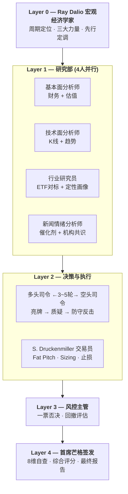

# Stock Analysis — AI 投资决策委员会

基于 Claude Code 多 Agent 架构的机构级投资分析系统，模拟真实投研决策流程。

## 架构



| 层级 | 角色 | 核心职能 |
|------|------|---------|
| L0 | Ray Dalio 宏观经济学家 | 周期定位 · 利率汇率 · 宏观定调 |
| L1 | 研究部 (4人并行) | 基本面 + 技术面 + 行业 + 新闻情绪 |
| L2 | 多空辩论 + Druckenmiller | 对抗辩论 · Fat Pitch · 交易方案 |
| L3 | 风控主管 | 一票否决 · 最大回撤评估 |
| L4 | 首席芒格签发 | 8维自查 · 综合评分 · 签发 |

## 人格构建方法

三个人格均通过 [女娲 · Skill造人术](https://github.com/alchaincyf/nuwa-skill) 蒸馏构建：从原始素材（视频字幕、著作、访谈记录、13F 持仓文件）中提取思维框架、表达风格与决策启发式，经多轮质量校验迭代而成。

各人格目录内 `references/research/` 保存了蒸馏过程中积累的系统性调研笔记。详见：
- [Dalio 人格定义](stock-research-team/personalities/dalio/SKILL.md)
- [Druckenmiller 人格定义](stock-research-team/personalities/druckenmiller/SKILL.md)
- [Munger 人格定义](stock-research-team/personalities/munger/SKILL.md)

## 功能

- 适配美股 / 港股 / A 股，自动识别市场
- 10 分制综合评分 + 操作建议 + 关键价位
- 结构化多空辩论（3-5 轮），分歧点清单
- Fat Pitch 判定 + 仓位管理 + 止损纪律
- 芒格 8 维自查（三筐分类、逆向思考、Lollapalooza 检测等）
- 全链路容错：单 Agent 失败不影响最终报告输出

## 依赖

- [Longbridge CLI](https://longbridge.com) — 行情、基本面、估值、新闻等数据
- Claude Code Agent 工具链
- WebSearch 能力

## 使用

在 Claude Code 中触发：

```
投资决策委员会分析 NVDA
研究一下 700.HK
分析 AAPL 现在值得投资吗
```

## 免责声明

⚠️ 本系统由 AI 自动生成分析报告，仅供参考，不构成投资建议。投资有风险，决策须谨慎。
