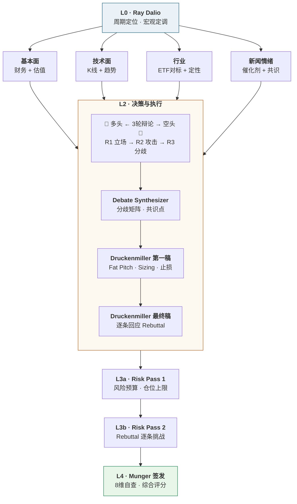

# Stock Analysis — AI 投资决策委员会

基于 Claude Code 多 Agent 架构的机构级投资分析系统。10 位独立 AI 分析师，五级委员会，结构化 JSON 合约，固定 3 轮辩论，Risk 双通闭环。

## 架构



## 五层委员会

| 层级 | 角色 | 人数 | 核心职能 | 输出 |
|------|------|:--:|------|------|
| L0 | Ray Dalio · 宏观经济学家 | 1 | 周期定位 · 利率汇率 · 宏观定调 | `dalio_macro.json` |
| L1 | 研究部 | 4 | 基本面 + 技术面 + 行业(含定性画像) + 新闻情绪 | 4× `researcher.json` |
| L2 | 多空辩论 + Synthesizer + Druckenmiller | 4 | 固定3轮辩论 · 分歧矩阵 · Fat Pitch · 交易方案 | 6× round + synthesis + 2× druckenmiller |
| L3 | Risk Manager (双通) | 1 | First Pass 预算 → Rebuttal 挑战 → PM 逐条回应 | `risk_first_pass.json` + `risk_rebuttal.json` |
| L4 | Munger · 首席审批官 | 1 | 8维自查 · 综合评分 · 签发 | `munger_final.json` |

## 核心特性

| 特性 | 说明 |
|------|------|
| **JSON 合约** | 每个 Agent 输出结构化 JSON 到 `reports/_raw/<TICKER>-<DATE>/`。下游 Read 上游，缺失即报错。消除自然语言传递导致的信息失真 |
| **Risk Rebuttal 闭环** | Druckenmiller 第一稿 → Risk 逐条挑战 → Final 逐条回应 (accept / partial / reject)。最终报告含完整 PM 回应表 |
| **可执行交易参数** | 强制输出 direction、entry_zone、stop_loss + logic、take_profit_levels、position_size_pct、holding_window_weeks，所有数字可追溯至上游锚点 |
| **Persona 路由** | 按市场 (US/HK/CN) 和行业动态调整 persona 权重。Munger 在半导体/AI/生物技术领域跳过能力圈维度，A股/港股降权 |
| **固定 3 轮辩论** | R1 立场陈述 → R2 交叉攻击 → R3 核心分歧 + concessions。禁止 R4+。Synthesizer 产出结构化分歧矩阵 |
| **时间序列 Diff** | `--diff-from <date>` 参数。新分析完全独立 (不读旧数据)，事后 diff_agent 分层对比 |

## 目录结构

```
stock-research-team/
├── SKILL.md                              # 主流程入口
├── SKILL_list_history.md                 # 历史分析列表
├── schemas/          (9 个 JSON)         # 输出合约定义
├── agents/                               # 功能 Agent
│   ├── debate_synthesizer.md             #   辩论综合器
│   ├── diff_agent.md                     #   时间序列对比
│   └── risk_manager/                     #   双模式风控
├── routing/                              # Persona 路由规则
├── templates/                            # 报告模板
└── personalities/                        # 对标真实人物的 Persona
    ├── dalio/          (10 个来源, 7 心智模型)
    ├── druckenmiller/  (45+ 来源, 7 心智模型)
    └── munger/         (50+ 来源, 5 心智模型)
```

## 人格构建

Dalio / Druckenmiller / Munger 三个人格均通过 [女娲 · Skill造人术](https://github.com/alchaincyf/nuwa-skill) 蒸馏构建：从原始素材 (视频字幕、著作、访谈记录、13F 持仓文件) 中提取思维框架、表达风格与决策启发式，经多轮质量校验迭代而成。

## 依赖

| 依赖 | 用途 |
|------|------|
| [Longbridge CLI](https://longbridge.com) | 行情 · 基本面 · 估值 · 新闻 · 日历 |
| Claude Code Agent 工具链 | 独立 Agent 并行执行 |
| WebSearch | 宏观数据 · 行业动态 · 机构研报 |

## 使用

```
/stock-research-team 分析 NVDA
/stock-research-team 研究一下 700.HK
/stock-research-team 分析 AAPL --diff-from 2026-04-15
/stock-research-team /list-history AAPL
```

> ⚠️ 本系统由 AI 自动生成分析报告，仅供参考，不构成投资建议。投资有风险，决策须谨慎。
